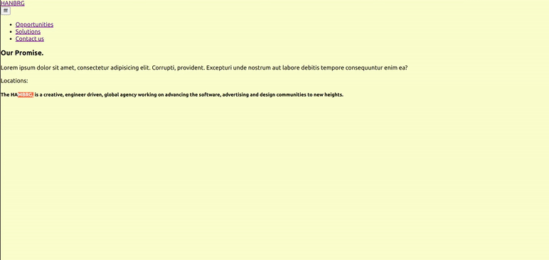
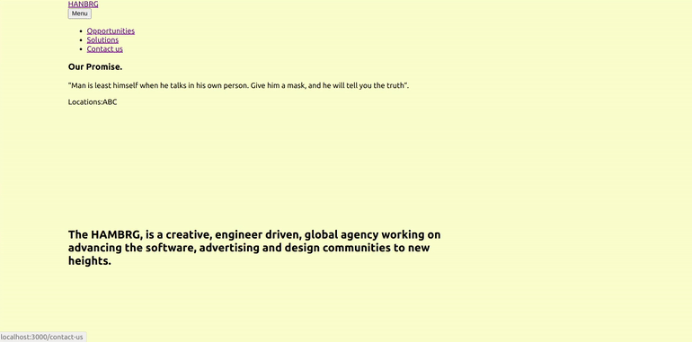

# TESTING the NM portfolio with the wrong akram from 0

##### YESTERDAY i tried to add it directly to the nm portofolio i ve been working on, and it didn't work because it was to complicated to do it with so much data related to the scrolling effect on the page So i started it from scratch

#### START by Installing the dependencies 👷‍♂️

[check out the installation](src/docs/INSTALLATION.md)

##### CHECK THE SNIPPETS TO MAKE IT EASIER

[check out the installation](src/docs/INSTALLATION.md)

<br>
<br>
<br>
<br>
<br>
<br>

# THE SET UP of the routers 🌵 🌵 🌵

- YOU ARE NOT GOING TO NEED ALL THIS BUT IT S GOOD FOR STARTING

```javascript
//
//
//  STEP 1
//
import React from "react";
import Header from "./components/Header";
import { BrowserRouter as Router, Switch, Route } from "react-router-dom";
//
//
//  STEP 2
//
function App() {
  return (
    <Router>
      <div className="App">
        <Header />
        <div className="container">
          <div className="wrapper">
            <div className="home">
              // ------------------- this is related to step 3
              <Switch>
                <Route exact path="/" component={Home} />
                <Route exact path="/opportunities" component={Opportunities} />
                <Route exact path="/solutions" component={Solutions} />
                <Route exact path="/contact-us" component={Contact} />
              </Switch>
              // ------------------- this is related to step 3
            </div>
          </div>
        </div>
      </div>
    </Router>
  );
}

//
//
//  STEP 3

function Opportunities() {
  // you can import the content component of this page "Opportunities"
  //   This is similar to what you have inside the .menuOPen in the other dropdown menu
  return <p>Discover our numerous opportunities</p>;
}

function Solutions() {
  return <p>Solutions that help you.</p>;
}

function Contact() {
  return <p>Feel free to reach us.</p>;
}

function Home() {
  return (
    <div className="container">
      <div className="wrapper">
        <h5>
          The <b>HAMBRG</b>, is a creative, engineer driven, global agency
          working on advancing the software, advertising and design communities
          to new heights.
        </h5>
      </div>
    </div>
  );
}
export default App;
```

<br>
<br>

#### Hamburger.js 🌵

- YOU WILL NOT NEED ALL THIS later for out project

<br>

```javascript
import React from "react";
import { Link } from "react-router-dom";

//
//
//
//
import React from "react";

const Hamburger = () => {
  return (
    <div className="hamburger-menu">
      <div className="menu-secondary-background-color"></div>

      <div className="menu-layer">
        <div className="menu-city-background"></div>

        <div className="container">
          <div className="wrapper">
            {/* ------- -------- */}
            <div className="menu-links">
              <nav>
                <ul>
                  <li>
                    <Link to="/opportunities">Opportunities</Link>
                  </li>
                  <li>
                    <Link to="/solutions">Solutions</Link>
                  </li>
                  <li>
                    <Link to="/contact-us">Contact us</Link>
                  </li>
                </ul>
              </nav>
              <div className="info">
                <h3>Our Promise.</h3>
                <p>
                  “Man is least himself when he talks in his own person. Give
                  him a mask, and he will tell you the truth“.
                </p>
              </div>
              <div className="locations">
                Locations:
                <span>A</span>
                <span>B</span>
                <span>C</span>
              </div>
            </div>
            {/* end menu links */}
          </div>
        </div>
        {/* end container */}
      </div>
    </div>
  );
};

export default Hamburger;
```

<br>
<br>
<br>

### Header.js 🌵

- YOU WILL NOT NEED ALL THIS later for out project

```javascript
import React from "react";
import { Link } from "react-router-dom";

import Hamburger from "./Hamburger";

const Header = () => {
  // STATE FOR MENU BUTTON

  return (
    <header>
      <div className="container">
        <div className="wrapper">
          <div className="inner-header">
            <div className="logo">
              <Link to="/">HANBRG</Link>
            </div>
            {/* ---------- */}
            <div className="menu">
              <button>fff</button>
            </div>
          </div>
        </div>
      </div>
      <Hamburger />
    </header>
  );
};

export default Header;
// withRouter will give access to the history PROP
// with the history we will be able to determine if the URL has been changed, so
// if it s change we will execute a certain command
```

<br>
<br>

### How it should look on the Browser

[]()

<br>
<br>
<br>

## THE STYLES 🌟

##### KEEP IN MIND that due to the fact we will be using the the SKEW SCROLL, the setting in the scss are not going to be the same specially if the container has a fixed height or width, which the skew scroll HASN'T

<br>

#### This isn't responsive, the container is the base template for the whole page, this is why you should think how you are going to adapt it to the SKEW SCROLL since the scroll setup isnt fixed. ⚠️

```scss
.container {
  width: 1280px;
  min-width: 1280px;
  margin: 0 auto;
  .wrapper {
    padding: 0 48px;
    // The .home is wrapping the routers and can cause ISSUES
    //  when adapting the scroll due to the flex
    // Maybe you can add the scroll {ref} on the .home that is on the routers
    .home {
      display: flex;
      justify-content: center;
      align-items: center;
      height: 100%;
      width: 100%;
```

<br>

#### Container styles

```scss
html,
body {
  padding: 0;
  margin: 0;
  font-family: "Poppins", -apple-system, BlinkMacSystemFont, "Segoe UI", Roboto,
    Oxygen, Ubuntu, Cantarell, "Open Sans", "Helvetica Neue", sans-serif;
}

body {
  background-color: lemonchiffon;
}

//
// -------------------
//        Container
// -------------------

/*
This isnt responsive, the container is the base template
for the whole page, that is why you should think how you
are going to adapt it to the SKEW SCROLL since the scroll setup
isnt fixed

.container {
  width: 1280px;
  min-width: 1280px;


So if you want the header to dropdown with a 100vw and
100vh you will have to set up individual settings for each
page ,as if you add the scrolling skew on the container its going
to be messy


*/

.container {
  width: 1280px;
  min-width: 1280px;
  margin: 0 auto;
  .wrapper {
    padding: 0 48px;
    // The .home is wrapping the routers and can cause ISSUES
    //  when adapting the scroll due to the flex
    // Maybe you can add the scroll {ref} on the .home that is on the routers
    .home {
      display: flex;
      justify-content: center;
      align-items: center;
      height: 100%;
      width: 100%;
      p {
        font-size: 0.75rem;
        letter-spacing: 0.3rem;
        text-transform: uppercase;
        // the font family is inside the body, here you make it slightly fatter
        font-weight: 500;
      }
      h5 {
        margin-top: 260px;
        font-size: 1.5rem;
        font-weight: 600;
        padding-right: 360px;
      }
    }
  }
}
// ------- end container
```

[]()

<br>
<br>

#### Header Styles

```scss
//
// -------------------
//        Header
// -------------------
//
header {
  height: 100px;
  .inner-header {
    position: relative;
    z-index: 10;
    height: 100px;
    display: flex;
    justify-content: space-between;
    align-items: center;
    .logo a {
      font-weight: 700;
      font-size: 1rem;
      text-decoration: none;
      color: #282828;
    }
    .menu {
      button {
        border: none;
        background: none;
        outline: none;
        cursor: pointer;
        font-size: 0.8rem;
        mix-blend-mode: difference;
      }
    }
  }
```
