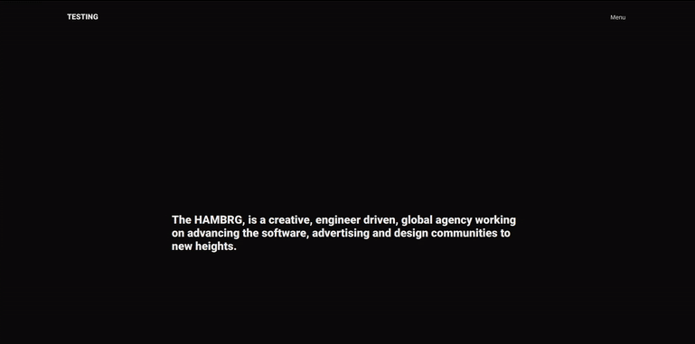

# TESTING THE WRONG AKRAM "dropdown" MENU FROM 0 🌵

###### I REPEATED THIS MENU TUTORIAL OUT OF FRUSTRATION WITH THE ONE I ADDED TO THIS FIRST PROJECT, THE OLD MENU CERTAINLY WORKS IN LOCAL BUT DONT REACT AT ALL WHEN DEPLOYING TO ftp filezilla.

[nav hash issue, svg diving with menu ](https://github.com/nadiamariduena/nadiamariduena-portfolio-with-react-createapp)

 

[Beginning of the nm portfolio | 3D three.js animations, perspective 3d animation etc ](https://github.com/nadiamariduena/nadiamariduena-portfolio)

 

 
 

###### SO INSTEAD OF COMPLICATING THE CODE "due to the scroll effect animation clash" I DECIDED TO REPEAT IT IN A CLEAN TEMPLATE.

###### BY RECREATING I SOLVED ANOTHER ISSUE THAT WAS RELATED TO THE "hash" ISSUE WHEN DEPLOYING TO FILEZILLA

 

 
 

 

#### START by Installing the dependencies 👷‍♂️

[check out the installation](src/docs/INSTALLATION.md)

##### CHECK THE SNIPPETS TO MAKE IT EASIER

[snippets to economize time when creating components](src/docs/INSTALLATION.md)

 
 

 

# THE SET UP of the Default _MENU_ 🌵 🌵 🌵

- YES THE ANIMATION WORKS when clicking Menu and Closing
- No! there's no DROPDOWN effect yet as we didnt sude GSAP
- The routes work perfectly with the help of the {history}
- It works even when uploading it to filezilla

 

##### THE PROCESS (default)

[The process (default) ](src/docs/FIRSTMENU-PROCESS.md)

##### THE FINAL RESULT (default)

[final result of the default version before gsap](src/docs/FIRSTMENU-READY.md)

 
 
 

 

# THE GSAP ANIMATION PHASE 🌵 🌵 🌵

 

### THE PROCESS

[The process ](src/docs/SECONDMENU-PROCESS.md)

##### DROPDOWN ANIMATION (skew)

##### TEXT ANIMATION

