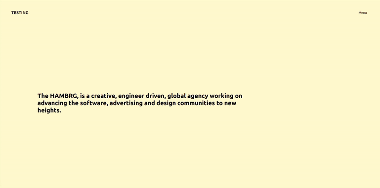

# THE SET UP of the routers 🌵 🌵 🌵

- YOU ARE NOT GOING TO NEED ALL THIS BUT IT S GOOD FOR STARTING

```javascript
//
//
//  STEP 1
//
import React from "react";
import Header from "./components/Header";
import { BrowserRouter as Router, Switch, Route } from "react-router-dom";
//
//
//  STEP 2
//
function App() {
  return (
    <Router>
      <div className="App">
        <Header />
        <div className="container">
          <div className="wrapper">
            <div className="home">
              // ------------------- this is related to step 3
              <Switch>
                <Route exact path="/" component={Home} />
                <Route exact path="/opportunities" component={Opportunities} />
                <Route exact path="/solutions" component={Solutions} />
                <Route exact path="/contact-us" component={Contact} />
              </Switch>
              // ------------------- this is related to step 3
            </div>
          </div>
        </div>
      </div>
    </Router>
  );
}

//
//
//  STEP 3

function Opportunities() {
  // you can import the content component of this page "Opportunities"
  //   This is similar to what you have inside the .menuOPen in the other dropdown menu
  return <p>Discover our numerous opportunities</p>;
}

function Solutions() {
  return <p>Solutions that help you.</p>;
}

function Contact() {
  return <p>Feel free to reach us.</p>;
}

function Home() {
  return (
    <div className="container">
      <div className="wrapper">
        <h5>
          The <b>HAMBRG</b>, is a creative, engineer driven, global agency
          working on advancing the software, advertising and design communities
          to new heights.
        </h5>
      </div>
    </div>
  );
}
export default App;
```

<br>
<br>

#### Hamburger.js 🌵

- YOU WILL NOT NEED ALL THIS later for out project

<br>

```javascript
import React from "react";
import { Link } from "react-router-dom";

//
//
//
//
import React from "react";

const Hamburger = () => {
  return (
    <div className="hamburger-menu">
      <div className="menu-secondary-background-color"></div>

      <div className="menu-layer">
        <div className="menu-city-background"></div>

        <div className="container">
          <div className="wrapper">
            {/* ------- -------- */}
            <div className="menu-links">
              <nav>
                <ul>
                  <li>
                    <Link to="/opportunities">Opportunities</Link>
                  </li>
                  <li>
                    <Link to="/solutions">Solutions</Link>
                  </li>
                  <li>
                    <Link to="/contact-us">Contact us</Link>
                  </li>
                </ul>
              </nav>
              <div className="info">
                <h3>Our Promise.</h3>
                <p>
                  “Man is least himself when he talks in his own person. Give
                  him a mask, and he will tell you the truth“.
                </p>
              </div>
              <div className="locations">
                Locations:
                <span>A</span>
                <span>B</span>
                <span>C</span>
              </div>
            </div>
            {/* end menu links */}
          </div>
        </div>
        {/* end container */}
      </div>
    </div>
  );
};

export default Hamburger;
```

<br>
<br>
<br>

### Header.js 🌵

- YOU WILL NOT NEED ALL THIS later for out project

```javascript
import React from "react";
import { Link } from "react-router-dom";

import Hamburger from "./Hamburger";

const Header = () => {
  // STATE FOR MENU BUTTON

  return (
    <header>
      <div className="container">
        <div className="wrapper">
          <div className="inner-header">
            <div className="logo">
              <Link to="/">HANBRG</Link>
            </div>
            {/* ---------- */}
            <div className="menu">
              <button>fff</button>
            </div>
          </div>
        </div>
      </div>
      <Hamburger />
    </header>
  );
};

export default Header;
// withRouter will give access to the history PROP
// with the history we will be able to determine if the URL has been changed, so
// if it s change we will execute a certain command
```

<br>
<br>

### How it should look on the Browser

[]()

<br>
<br>
<br>

## THE STYLES 🌟

##### KEEP IN MIND that due to the fact we will be using the the SKEW SCROLL, the setting in the scss are not going to be the same specially if the container has a fixed height or width, which the skew scroll HASN'T

<br>

#### This isn't responsive, the container is the base template for the whole page, this is why you should think how you are going to adapt it to the SKEW SCROLL since the scroll setup isnt fixed. ⚠️

```scss
.container {
  width: 1280px;
  min-width: 1280px;
  margin: 0 auto;
  .wrapper {
    padding: 0 48px;
    // The .home is wrapping the routers and can cause ISSUES
    //  when adapting the scroll due to the flex
    // Maybe you can add the scroll {ref} on the .home that is on the routers
    .home {
      display: flex;
      justify-content: center;
      align-items: center;
      height: 100%;
      width: 100%;
```

<br>

#### Container styles

```scss
html,
body {
  padding: 0;
  margin: 0;
  font-family: "Poppins", -apple-system, BlinkMacSystemFont, "Segoe UI", Roboto,
    Oxygen, Ubuntu, Cantarell, "Open Sans", "Helvetica Neue", sans-serif;
}

body {
  background-color: lemonchiffon;
}

//
// -------------------
//        Container
// -------------------

/*
This isnt responsive, the container is the base template
for the whole page, that is why you should think how you
are going to adapt it to the SKEW SCROLL since the scroll setup
isnt fixed

.container {
  width: 1280px;
  min-width: 1280px;


So if you want the header to dropdown with a 100vw and
100vh you will have to set up individual settings for each
page ,as if you add the scrolling skew on the container its going
to be messy


*/

.container {
  width: 1280px;
  min-width: 1280px;
  margin: 0 auto;
  .wrapper {
    padding: 0 48px;
    // The .home is wrapping the routers and can cause ISSUES
    //  when adapting the scroll due to the flex
    // Maybe you can add the scroll {ref} on the .home that is on the routers
    .home {
      display: flex;
      justify-content: center;
      align-items: center;
      height: 100%;
      width: 100%;
      p {
        font-size: 0.75rem;
        letter-spacing: 0.3rem;
        text-transform: uppercase;
        // the font family is inside the body, here you make it slightly fatter
        font-weight: 500;
      }
      h5 {
        margin-top: 260px;
        font-size: 1.5rem;
        font-weight: 600;
        padding-right: 360px;
      }
    }
  }
}
// ------- end container
```

[]()

<br>
<br>

#### Header Styles 🌵

<br>

- z-index DO NOT WORK unless you define a position

- With the code Below, the links will not work anymore, and that is because we are missing the absolute part to connect with the relative, so to make use of the z-index.

```scss
//
// -------------------
//        Header
// -------------------
//
header {
  height: 100px;
  .inner-header {
    //   z-index DO NOT WORK unless you define a position
    // So if you dont define a position relative / absolute they dont know to what the z-index have to be relative to.
    position: relative;
    z-index: 10;
    //
    //
    height: 100px;
    display: flex;
    justify-content: space-between;
    align-items: center;
    .logo a {
      font-weight: 700;
      font-size: 1rem;
      text-decoration: none;
      color: #282828;
    }
    .menu {
      button {
        border: none;
        background: none;
        outline: none;
        cursor: pointer;
        font-size: 0.8rem;
        mix-blend-mode: difference;
      }
    }
  }
}
```

##### The missing part

```scss
//
// -------------------
//        Header
// -------------------
//
header {
  height: 100px;
  .inner-header {
    //   z-index DO NOT WORK unless you define a position
    // So if you dont define a position relative / absolute they dont know to what the z-index have to be relative to.
    position: relative;
    z-index: 10;
    //
    //
    height: 100px;
    display: flex;
    justify-content: space-between;
    align-items: center;
    .logo a {
      font-weight: 700;
      font-size: 1rem;
      text-decoration: none;
      color: #282828;
    }
    .menu {
      button {
        border: none;
        background: none;
        outline: none;
        cursor: pointer;
        font-size: 0.8rem;
        mix-blend-mode: difference;
      }
    }
  }
}
```

[]()

<br>
<br>

#### SET UP A CONTAINER-SKEW with a scroll , i think with a container skew , the other container settings can stay as they are

<br>
<br>

<br>
<br>

# 🌩️ THE NAVIGATION ANIMATION 🌩️

<br>

### Header.js 🌵

```javascript
import React, { useState } from "react";
import { Link } from "react-router-dom";

import Hamburger from "./Hamburger";
// type: sfc snippet: const  = () => {
//
//1
const Header = () => {
  //
  //2
  const [state, setState] = useState({
    //   BY DEFAULT IT IS "Menu" because nothing is happening
    initial: false,
    clicked: null,
    menuName: "Menu",
  });
  //
  // 5 create a second useSate ,to prevent spam when opening and closing the menu
  //
  const [disabled, setDisabled] = useState(false);

  //
  //
  //
  //
  // 3 this function is related to the event on click of the button menu, it will handle the state on change in step 2
  const handleMenu = () => {
    //   7
    disabledMenu();
    /*
     the disabled attr , is going to prevent spam
                from happening, that spam can ruin the effect
                of the hamburger menu when opening and closing
                it, this disabled attr is linked to :
    
    
    
         <div className="menu">
              <button disabled={disabled} onClick={handleMenu}>
                Menu
              </button>
            </div>
    
    
    */
    //
    //
    // step 3
    if (state.initial === false) {
      setState({
        initial: null, //means that we already clicked at least once
        clicked: true,
        menuName: "Close",
      });
      //  -------------

      console.log(1);
    } else if (state.clicked === true) {
      setState({
        clicked: !state.clicked,
        menuName: "Menu",
      });
      console.log(2);
    } else if (state.clicked === false) {
      setState({
        clicked: !state.clicked,
        menuName: "Close",
      });
      console.log(3);
    }
  };
  //
  // 6 function related to step 5
  //This function will let us know if the menu button will be disabled or not
  //   this function will be called in step 3
  const disabledMenu = () => {
    setDisabled(!disabled);
    setTimeout(() => {
      setDisabled(false);
    }, 1200); //we want this to run every 12 hundred milisecs
  }; //
  //
  return (
    <header>
      <div className="nav_container">
        <div className="nav_wrapper">
          {/* the inner header is the 100px box where the logo and the menu button are situated */}
          <div className="inner-header">
            <div className="logo">
              <Link to="/">HANBRG</Link>
            </div>
            {/* ---------- */}
            <div className="menu">
              <button disabled={disabled} onClick={handleMenu}>
                Menu
              </button>
            </div>
          </div>
        </div>
      </div>
      <Hamburger />
    </header>
  );
};

export default Header;
```

<br>
<br>

### THE HAMBURGER.JS 🌵

```javascript
import React, { useEffect, useRef } from "react";
// the useRef will gives us access to the hamburger-menu in the DOM
import { Link } from "react-router-dom";

//
//
// 1
// type: sfc snippet: const  = () => {
const Hamburger = ({ state }) => {
  // Here is how you access the state in the menuTwo.js :
  // const Hamburger = ({ state }) => {
  //
  //
  // 3
  let menu = useRef(null);

  //
  //
  //
  // 2     create the useEffect to access the states inside the MenuTwo.js
  //   uef snippet to create a useEffect
  //   the reason for the state fuunction not defined was due to the fact i forgot to make the connection inside the header here:    <Hamburger state={state} />
  useEffect(() => {
    if (state.clicked === false) {
      // step4
      // if its not clicked ,HIDE the dropdown
      menu.style.display = "none";
    } else if (
      state.clicked === true ||
      (state.clicked === true && state.initial === null)
    ) {
      // step5
      // if its clicked ,SHOW the dropdown
      menu.style.display = "flex";
    }
  });
  //
  //

  // -------------------
  // JSX DATA
  return (
    //   connected to step 3 . 4/5 for example: menu.style.display = "flex";
    <div ref={(el) => (menu = el)} className="hamburger-menu">
      <div className="nav_menu-layer">

```

<br>
<br>

## THE ERROR ⚠️

```javascript
TypeError: Cannot read property 'clicked' of undefined
(anonymous function)
src/components/Hamburger.js:24
  21 |   //   uef snippet to create a useEffect
  22 | //   the reason for the state fuunction not defined was due to the fact i forgot to make the connection inside the header here:    <Hamburger state={state} />
  23 |   useEffect(() => {
> 24 |     if (state.clicked === false) {
  25 |       menu.style.display = "none";
  26 |     } else if (
  27 |       state.clicked === true ||
```

##### the reason for that error in the code below :

```javascript
useEffect(() => {
  if (state.clicked === false) {
    // if its not clicked ,HIDE the dropdown
    menu.style.display = "none"; //this is the basic, as it s going to be relaced by GSAP
  } else if (
    state.clicked === true ||
    (state.clicked === true && state.initial === null)
  ) {
    // if its clicked ,SHOW the dropdown
    menu.style.display = "block"; //this is the basic, as it s going to be relaced by GSAP
  }
});
```

##### is that i forgot to make the connection with the header.js , i certainly did INITIALIZE the {state} here:

```javascript
// Hamburger.js
const Hamburger = ({ state }) => {
```

##### BUT i forgot to add it here inside the Header.js

```javascript
// Header.js
<Hamburger state={state} />
```

[ ]()

<br>

#### THE HAMBURGER.JS 🌵

```javascript
import React, { useEffect, useRef } from "react";
// the useRef will gives us access to the hamburger-menu in the DOM
import { Link } from "react-router-dom";

//
//
// 1
// type: sfc snippet: const  = () => {
const Hamburger = ({ state }) => {
  // Here is how you access the state in the menuTwo.js :
  // const Hamburger = ({ state }) => {
  //
  //
  // 3
  let menu = useRef(null);

  //
  //
  //
  // 2     create the useEffect to access the states inside the MenuTwo.js
  //   uef snippet to create a useEffect
  //   the reason for the state fuunction not defined was due to the fact i forgot to make the connection inside the header here:    <Hamburger state={state} />
  useEffect(() => {
    if (state.clicked === false) {
      // if its not clicked ,HIDE the dropdown
      menu.style.display = "none";
    } else if (
      state.clicked === true ||
      (state.clicked === true && state.initial === null)
    ) {
      // if its clicked ,SHOW the dropdown
      menu.style.display = "flex";
    }
  });
  //
  //

  // -------------------
  // JSX DATA
  return (
    <div ref={(el) => (menu = el)} className="hamburger-menu">
      <div className="nav_menu-layer">
        <div className="nav_container">
          <div className="nav_wrapper">
            {/* ------- nav open -------- */}
            <div className="menu-links">
              <nav>
                <ul>
                  <li>
                    <Link to="/opportunities">Opportunities</Link>
                  </li>
                  <li>
                    <Link to="/solutions">Solutions</Link>
                  </li>
                  <li>
                    <Link to="/contact-us">Contact us</Link>
                  </li>
                </ul>
              </nav>
              {/* the info we dont need */}
              <div className="info">
                <h3>Our Promise.</h3>
                <p>
                  “Man is least himself when he talks in his own person. Give
                  him a mask, and he will tell you the truth“.
                </p>
              </div>
              {/* the info we dont need */}
              <div className="locations">
                Locations:
                <span>A</span>
                <span>B</span>
                <span>C</span>
              </div>
            </div>
            {/* ------- nav open -------- */}
          </div>
        </div>
        {/* end container */}
      </div>
    </div>
  );
};

export default Hamburger;
```

<br>

#### THE ANIMATION IS WORKING but there is an ISSUE ⚠️

###### IF YOU NOTICE, When you open the dropdown it certainly works but when you try to click on the links it doesnt work, yes you can see that the url changes but its not bringing you there.

<br>

##### THE SOLUTION 🍰

- 1 GO BACK TO THE HEADER.JS

- 2 ADD THE FOLLOWING HERE:

```javascript
import { withRouter, Link } from "react-router-dom";
//
//
export default withRouter(Header);
```

<br>

## "withRouter"

- withRouter will give access to the history PROP
- with the history we will be able to determine if the URL has been changed, so
- if it s change we will execute a certain command

- 3 ADD A useEffect to the Header.js

```javascript
import React, { useState, useEffect } from "react";

//
//
useEffect(() => {
  // Listen for page changes,
  //   after you add the code with the function below, add the history here:
  history.listen(() => {
    setState({ clicked: false, menuName: "Menu" });
  });
});
```

#### ERROR

```javascript
Failed to compile
src/components/Header.js
  Line 33:5:  Unexpected use of 'history'  no-restricted-globals

Search for the keywords to learn more about each error.
This error occurred during the build time and cannot be dismissed.
```

##### the solution

- ADD THE {history} related to the function history.listen(() => {

```javascript
// Header.js
const Header = ({ history }) => {
```

<br>
<br>

### the code 🦄

```javascript
import React, { useState, useEffect } from "react";
import { withRouter, Link } from "react-router-dom";

import Hamburger from "./Hamburger";
// type: sfc snippet: const  = () => {
//
//1
const Header = ({ history }) => {
  //STATE FOR Menu withRouter related

  //
  //
  //
  //2
  const [state, setState] = useState({
    //   BY DEFAULT IT IS "Menu" because nothing is happening
    initial: false,
    clicked: null,
    menuName: "Menu",
  });
  //
  //
  //STATE FOR disabled Button
  // 5 create a second useSate ,to prevent spam when opening and closing the menu
  //
  const [disabled, setDisabled] = useState(false);

  //
  // USEEFFECT for page change ------
  //   this is related to the issue page change after the animation worked
  useEffect(() => {
    // Listen for page changes, after you add the code
    //  with the function below, add this:
    //
    history.listen(() => {
      setState({ clicked: false, menuName: "Menu" });
    });
  });

  //
  //
  // 3 this function is related to the event on click of the button menu, it will handle the state on change in step 2
  const handleMenu = () => {
    //   7
    disabledMenu();
    //
    //
    // step 3
    if (state.initial === false) {
      setState({
        initial: null, //means that we already clicked at least once
        clicked: true,
        menuName: "Close",
      });
      //  -------------

      console.log(1);
    } else if (state.clicked === true) {
      setState({
        clicked: !state.clicked,
        menuName: "Menu",
      });
      console.log(2);
    } else if (state.clicked === false) {
      setState({
        clicked: !state.clicked,
        menuName: "Close",
      });
      console.log(3);
    }
  };
  //
  // 6 function related to step 5
  //This function will let us know if the menu button will be disabled or not
  //   this function will be called in step 3
  const disabledMenu = () => {
    setDisabled(!disabled);
    setTimeout(() => {
      setDisabled(false);
    }, 500); //we want this to run every 12 hundred milisecs
  }; //
  //
  return (
    <header>
      <div className="nav_container">
        <div className="nav_wrapper">
          {/* the inner header is the 100px box where the logo and the menu button are situated */}
          <div className="inner-header">
            <div className="logo">
              <Link to="/">HANBRG</Link>
            </div>
            {/* ---------- */}
            <div className="menu">
              <button disabled={disabled} onClick={handleMenu}>
                {state.menuName}
              </button>
            </div>
          </div>
        </div>
      </div>
      <Hamburger state={state} />
    </header>
  );
};

export default withRouter(Header);
// withRouter will give access to the history PROP
// with the history we will be able to determine if the URL has been changed, so
// if it s change we will execute a certain command
```

<br>
<br>

[]()

[ ]()
