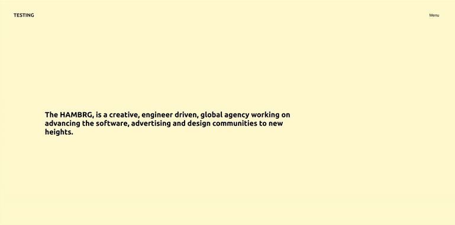

## This is the setup of the menu before adding the GSAP animation

[ ]()

<br>

- YES THE ANIMATION WORKS when clicking Menu and Closing
- No there s no DROPDOWN effect
- The routes work perfectly with the helps of the history
- It works even when uploading it to filezilla

### SO here is the code for the Hamburger.js, the Header.js , the App.js and the SCSS

<br>

##### Hamburger.js

```javascript
import React, { useEffect, useRef } from "react";
// the useRef will gives us access to the hamburger-menu in the DOM
import { Link } from "react-router-dom";

//
//
// 1
// type: sfc snippet: const  = () => {
const Hamburger = ({ state }) => {
  // Here is how you access the state in the menuTwo.js :
  // const Hamburger = ({ state }) => {
  //
  //
  // 3
  let menu = useRef(null);

  //
  //
  //
  // 2     create the useEffect to access the states inside the MenuTwo.js
  //   uef snippet to create a useEffect
  //   the reason for the state fuunction not defined was due to the fact i forgot to make the connection inside the header here:    <Hamburger state={state} />
  useEffect(() => {
    if (state.clicked === false) {
      // if its not clicked ,HIDE the dropdown
      menu.style.display = "none";
    } else if (
      state.clicked === true ||
      (state.clicked === true && state.initial === null)
    ) {
      // if its clicked ,SHOW the dropdown
      menu.style.display = "flex";
    }
  });
  //
  //

  // -------------------
  // JSX DATA
  return (
    <div ref={(el) => (menu = el)} className="hamburger-menu">
      <div className="nav_menu-layer">
        <div className="nav_container">
          <div className="nav_wrapper">
            {/* ------- nav open -------- */}
            <div className="menu-links">
              <nav>
                <ul>
                  <li>
                    <Link to="/opportunities">Opportunities</Link>
                  </li>
                  <li>
                    <Link to="/solutions">Solutions</Link>
                  </li>
                  <li>
                    <Link to="/contact-us">Contact us</Link>
                  </li>
                </ul>
              </nav>
              {/* the info we dont need */}
              <div className="info">
                <h3>Our Promise.</h3>
                <p>
                  “Man is least himself when he talks in his own person. Give
                  him a mask, and he will tell you the truth“.
                </p>
              </div>
              {/* the info we dont need */}
              <div className="locations">
                Locations:
                <span>A</span>
                <span>B</span>
                <span>C</span>
              </div>
            </div>
            {/* ------- nav open -------- */}
          </div>
        </div>
        {/* end container */}
      </div>
    </div>
  );
};

export default Hamburger;
```

<br>
<br>
<br>

##### Header.js

<br>

```javascript
import React, { useState, useEffect } from "react";
import { withRouter, Link } from "react-router-dom";

import Hamburger from "./Hamburger";
// type: sfc snippet: const  = () => {
//
//1
const Header = ({ history }) => {
  //STATE FOR Menu withRouter related

  //
  //
  //
  //2
  const [state, setState] = useState({
    //   BY DEFAULT IT IS "Menu" because nothing is happening
    initial: false,
    clicked: null,
    menuName: "Menu",
  });
  //
  //
  //STATE FOR disabled Button
  // 5 create a second useSate ,to prevent spam when opening and closing the menu
  //
  const [disabled, setDisabled] = useState(false);

  //
  // USEEFFECT for page change ------
  //   this is related to the issue page change after the animation worked
  useEffect(() => {
    // Listen for page changes, after you add the code
    //  with the function below, add this:
    //
    history.listen(() => {
      setState({ clicked: false, menuName: "Menu" });
    });
  });

  //
  //
  // 3 this function is related to the event on click of the button menu, it will handle the state on change in step 2
  const handleMenu = () => {
    //   7
    disabledMenu();
    //
    //
    // step 3
    if (state.initial === false) {
      setState({
        initial: null, //means that we already clicked at least once
        clicked: true,
        menuName: "Close",
      });
      //  -------------

      console.log(1);
    } else if (state.clicked === true) {
      setState({
        clicked: !state.clicked,
        menuName: "Menu",
      });
      console.log(2);
    } else if (state.clicked === false) {
      setState({
        clicked: !state.clicked,
        menuName: "Close",
      });
      console.log(3);
    }
  };
  //
  // 6 function related to step 5
  //This function will let us know if the menu button will be disabled or not
  //   this function will be called in step 3
  const disabledMenu = () => {
    setDisabled(!disabled);
    setTimeout(() => {
      setDisabled(false);
    }, 500); //we want this to run every 12 hundred milisecs
  }; //
  //
  return (
    <header>
      <div className="nav_container">
        <div className="nav_wrapper">
          {/* the inner header is the 100px box where the logo and the menu button are situated */}
          <div className="inner-header">
            <div className="logo">
              <Link to="/">TESTING</Link>
            </div>
            {/* ---------- */}
            <div className="menu">
              <button disabled={disabled} onClick={handleMenu}>
                {state.menuName}
              </button>
            </div>
          </div>
        </div>
      </div>
      <Hamburger state={state} />
    </header>
  );
};

export default withRouter(Header);
// withRouter will give access to the history PROP
// with the history we will be able to determine if the URL has been changed, so
// if it s change we will execute a certain command
```

<br>
<br>
<br>

##### App.js

<br>

```javascript
import React from "react";
import Header from "./components/Header";
import { BrowserRouter as Router, Switch, Route } from "react-router-dom";

function App() {
  return (
    <Router>
      <div className="App">
        <Header />
        <div className="container">
          <div className="wrapper">
            <div className="home">
              <Switch>
                <Route exact path="/" component={Home} />
                <Route exact path="/opportunities" component={Opportunities} />
                <Route exact path="/solutions" component={Solutions} />
                <Route exact path="/contact-us" component={Contact} />
              </Switch>
            </div>
          </div>
        </div>
      </div>
    </Router>
  );
}

function Opportunities() {
  // you can import the content component of this page "Opportunities"
  return <p>Discover our numerous opportunities</p>;
}

function Solutions() {
  return <p>Solutions that help you.</p>;
}

function Contact() {
  return <p>Feel free to reach us.</p>;
}

function Home() {
  return (
    <div className="container">
      <div className="wrapper">
        <h5>
          The <b>HAMBRG</b>, is a creative, engineer driven, global agency
          working on advancing the software, advertising and design communities
          to new heights.
        </h5>
      </div>
    </div>
  );
}
export default App;
```

<br>
<br>
<br>

#### The scss navigation

- YOU MUST TO KEEP IN MIND THAT YOU SHOULD CREATE THE STYLES FOR THE "container" and the "wrapper" that is being used for must of the pages and that is even included inside the ROUTES

<br>

```scss
.nav_container {
  width: 100vw;
  height: 100vh;
  margin: 0 auto;
  // here was green
  .nav_wrapper {
    padding: 0 48px;
    // The .home is wrapping the routers and can cause ISSUES
    //  when adapting the scroll due to the flex
    // Maybe you can add the scroll {ref} on the .home that is on the routers
    .home {
      display: flex;
      justify-content: center;
      align-items: center;
      height: 100%;
      width: 100%;
      p {
        font-size: 0.75rem;
        letter-spacing: 0.3rem;
        text-transform: uppercase;
        // the font family is inside the body, here you make it slightly fatter
        font-weight: 500;
      }
      h5 {
        margin-top: 260px;
        font-size: 24px;
        font-weight: 600;
        padding-right: 360px;
      }
    }
  }
}

// -------------------
//        Header
// -------------------
//

header {
  height: 100px;
  .inner-header {
    //   z-index DO NOT WORK unless you define a position
    // So if you dont define a position relative / absolute /fixed they dont know to what the z-index have to be relative to.
    position: relative;
    z-index: 10;
    // background-color: green;
    // border: 1px solid #000;
    //
    //
    height: 100px;
    display: flex;
    justify-content: space-between;
    align-items: center;
    .logo a {
      font-weight: 700;
      font-size: 1rem;
      text-decoration: none;
      color: #282828;
    }
    .menu {
      button {
        border: none;
        background: none;
        outline: none;
        cursor: pointer;
        font-size: 0.8rem;
        mix-blend-mode: difference;
      }
    }
  }

  //   -------------------
  //          Hamburger
  //   -------------------

  .hamburger-menu {
    display: none; //you can replace it with display just to see what you have
    z-index: 9; //it means it will be under the green box of the .inner-header {  since  the .inner-header has a z-index: 10;
    top: 0;
    left: 0;
    right: 0;
    position: fixed;
    height: 100%;
    width: 100%;

    //
    //-------------
    //  .menu-layer  is the .nav.open in the old dropdown menu
    //-------------
    //
    .nav_menu-layer {
      position: relative;
      //   box-decoration-break: 1px solid green;
      background-color: red;
      height: 100%;
      overflow: hidden;
      //   we dont need this either

      .nav_wrapper {
        position: relative; //relative to the nav_container
        //

        //-------------
        //  .menu-layer  is the .nav.open in the old dropdown menu
        //-------------
        //
        .menu-links {
          display: flex;
          justify-content: space-between;
          align-items: center;
          position: relative;
          top: 200px;
          nav {
            display: block;
            ul {
              margin: 0;
              padding: 0;
              li {
                list-style: none;
                font-size: 6rem;
                font-weight: 700;
                cursor: pointer;
                height: 135px;
                overflow: hidden;
                position: relative;
                width: 700px;
                a {
                  position: absolute;
                  color: #fff;
                  text-decoration: none;
                  &:hover {
                    color: #282828;
                  }
                }
              }
            }
          }
          //   this we also dont need
          .info {
            color: #fff;
            width: 300px;
            h3 {
              font-size: 1.2rem;
              margin: 8px auto;
            }
            p {
              margin: 0 auto;
              font-size: 0.8rem;
            }
          }
        }
        // this we dont need but maybe we can fin a replacement
        .locations {
          position: absolute;
          bottom: -80px;
          color: #fff;
          margin-top: 16px;
          font-size: 0.8rem;
          font-weight: 600;
          span {
            cursor: pointer;
            &:first-child {
              margin-left: 64px;
            }
            font-weight: 400;
            margin: 0 32px;
            transition: 0.3s ease-in-out;
            &:hover {
              color: #fff;
              background: #282828;
              padding: 8px 24px;
              border-radius: 4px;
            }
          }
        }
        //-**
      }
    }
    //
    //-------------
    //  .menu-layer  end
    //-------------
    //
  }

  //    end hamburger menu
}
```

<br>
<br>
<br>
<br>

# 🌵 🏜️ 🌵

#### This main.scss will be changed as the Sstructure inside the portfolio "nm" isnt the same due to the "SCROLL" animation.

- FOR EXAMPLE, in the .container the width and the height is fixed

<br>

```scss
@import "nav_container";

html,
body {
  padding: 0;
  margin: 0;
  font-family: "Poppins", -apple-system, BlinkMacSystemFont, "Segoe UI", Roboto,
    Oxygen, Ubuntu, Cantarell, "Open Sans", "Helvetica Neue", sans-serif;
}

body {
  background-color: lemonchiffon;
}
//
//
// -------------------
//        Container
// -------------------

/*
This isnt responsive, the container is the base template
for the whole page, that is why you should think how you
are going to adapt it to the SKEW SCROLL since the scroll setup
isnt fixed

.container {
  width: 1280px;
  min-width: 1280px;


So if you want the header to dropdown with a 100vw and 
100vh you will have to set up individual settings for each 
page ,as if you add the scrolling skew on the container its going
to be messy


*/
.container {
  width: 1280px;
  min-width: 1280px;
  margin: 0 auto;
  .wrapper {
    padding: 0 48px;
    // The .home is wrapping the routers and can cause ISSUES
    //  when adapting the scroll due to the flex
    // Maybe you can add the scroll {ref} on the .home that is on the routers
    .home {
      display: flex;
      justify-content: center;
      align-items: center;
      height: 100%;
      width: 100%;
      p {
        font-size: 0.75rem;
        letter-spacing: 0.3rem;
        text-transform: uppercase;
        // the font family is inside the body, here you make it slightly fatter
        font-weight: 500;
      }
      h5 {
        margin-top: 260px;
        font-size: 24px;
        font-weight: 600;
        padding-right: 360px;
      }
    }
  }
}
```
