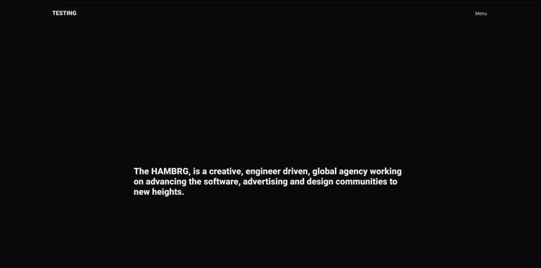

# 🌵 THE GSAP ANIMATION PHASE 🌵

## BEFORE START

- I REMOVED A LOT OF DIVS because i think it was too much for the same effect i already had with the old dropdown menu.

<br>

#### SO HERE IS THE CHANGE 🏜️

<br>

##### Hamburger.js

```javascript
import React, { useEffect, useRef } from "react";
// the useRef will gives us access to the hamburger-menu in the DOM
import { Link } from "react-router-dom";

//
//
// 1
// type: sfc snippet: const  = () => {
const Hamburger = ({ state }) => {
  // Here is how you access the state in the menuTwo.js :
  // const Hamburger = ({ state }) => {

  //
  //
  //
  //
  // 3
  // START WITH GSAP animation
  //
  let menu = useRef(null);

  //
  //
  //
  //
  //
  //
  // 2     create the useEffect to access the states inside the MenuTwo.js
  //   uef snippet to create a useEffect
  //   the reason for the state function not defined was due to the fact i forgot to make the connection inside the header here:    <Hamburger state={state} />
  useEffect(() => {
    if (state.clicked === false) {
      // if its not clicked ,HIDE the dropdown
      menu.style.display = "none";
    } else if (
      state.clicked === true ||
      (state.clicked === true && state.initial === null)
    ) {
      // if its clicked ,SHOW the dropdown
      menu.style.display = "block";
    }
  });
  //
  //

  // -------------------
  // JSX DATA
  return (
    // liked to step 3
    <div ref={(el) => (menu = el)} className="hamburger-menu">
      <div className="nav_menu-layer">
        <div className="nav_menu-layer-wrapper">
          {/* ------- nav open -------- */}
          <div className="menu-links">
            <nav>
              <ul>
                <li>
                  <Link to="/opportunities">Opportunities</Link>
                </li>
                <li>
                  <Link to="/solutions">Solutions</Link>
                </li>
                <li>
                  <Link to="/contact-us">Contact us</Link>
                </li>
              </ul>
            </nav>
            {/* the info we dont need */}
            <div ref={(el) => (info = el)} className="info">
              <h3>Our Promise.</h3>
              <p>
                “Man is least himself when he talks in his own person. Give him
                a mask, and he will tell you the truth“.
              </p>
            </div>
            {/* the info we dont need */}
            <div className="locations">
              Locations:
              <span>A</span>
              <span>B</span>
              <span>C</span>
            </div>
          </div>
          {/* ------- nav open -------- */}
        </div>
      </div>
    </div>
  );
};

export default Hamburger;
```

<br>
<br>
<br>

#### Header.js

```javascript
import React, { useState, useEffect } from "react";
import { withRouter, Link } from "react-router-dom";

import Hamburger from "./Hamburger";
// type: sfc snippet: const  = () => {
//
//1
const Header = ({ history }) => {
  //STATE FOR Menu withRouter related

  //
  //
  //
  //2
  const [state, setState] = useState({
    //   BY DEFAULT IT IS "Menu" because nothing is happening
    initial: false,
    clicked: null,
    menuName: "Menu",
  });
  //
  //
  //STATE FOR disabled Button
  // 5 create a second useSate ,to prevent spam when opening and closing the menu
  //
  const [disabled, setDisabled] = useState(false);

  //
  // USEEFFECT for page change ------
  //   this is related to the issue page change after the animation worked
  useEffect(() => {
    // Listen for page changes, after you add the code
    //  with the function below, add this:
    //
    history.listen(() => {
      setState({ clicked: false, menuName: "Menu" });
    });
  });

  //
  //
  // 3 this function is related to the event on click of the button menu, it will handle the state on change in step 2
  const handleMenu = () => {
    //   7
    disabledMenu();
    //
    //
    // step 3
    if (state.initial === false) {
      setState({
        initial: null, //means that we already clicked at least once
        clicked: true,
        menuName: "Close",
      });
      //  -------------

      console.log(1);
    } else if (state.clicked === true) {
      setState({
        clicked: !state.clicked,
        menuName: "Menu",
      });
      console.log(2);
    } else if (state.clicked === false) {
      setState({
        clicked: !state.clicked,
        menuName: "Close",
      });
      console.log(3);
    }
  };
  //
  // 6 function related to step 5
  //This function will let us know if the menu button will be disabled or not
  //   this function will be called in step 3
  const disabledMenu = () => {
    setDisabled(!disabled);
    setTimeout(() => {
      setDisabled(false);
    }, 500); //we want this to run every 12 hundred milisecs
  }; //
  //
  return (
    <header>
      <div className="inner-header">
        <div className="logo">
          <Link to="/">TESTING</Link>
        </div>
        {/* ---------- */}
        <div className="menu">
          <button disabled={disabled} onClick={handleMenu}>
            {state.menuName}
          </button>
        </div>
      </div>

      <Hamburger state={state} />
    </header>
  );
};

export default withRouter(Header);
// withRouter will give access to the history PROP
// with the history we will be able to determine if the URL has been changed, so
// if it s change we will execute a certain command
```

<br>
<br>
<br>

#### SCSS STYLES

```scss
/*
.nav.container is inside the <header>
the nav container wraps the nav wrapper , inner header
inside the inner header is the logo and the menu button.

OUTSIDE the header is the Hamburger data 
which corresponds to the 

hamburger-menu 
INSIDE the hamburger menu there is the:
nav_menu_layer  inside it you have the .menu-links
which is the content links

*/

// -------------------
//        Header
// -------------------
//

header {
  width: 100vw;
  height: 10vh;
  display: flex;
  justify-content: center;
  align-items: center;
  border: 1px solid rgb(190, 253, 15);

  .inner-header {
    display: flex;
    justify-content: space-between;
    align-items: center;
    width: 80%;
    height: 100%;
    // background-color: saddlebrown;
    border: 1px solid #000;
    // -----------
    //   z-index DO NOT WORK unless you define a position
    // So if you dont define a position relative / absolute /fixed they dont know to what the z-index have to be relative to.
    position: relative;
    z-index: 10;
    // ------------
    //

    .logo a {
      font-weight: 700;
      font-size: 1rem;
      text-decoration: none;
      color: #282828;
    }
    .menu {
      button {
        border: none;
        background: none;
        outline: none;
        cursor: pointer;
        font-size: 0.8rem;
        mix-blend-mode: difference;
      }
    }
  }

  //
  //
  //
  // ---------------------
  //
  // Hamburger content , it s what is going
  // to be shown when clicking on the menu button
  //
  //
  //   -------------------
  //          Hamburger
  //   -------------------
  // nav open
  .hamburger-menu {
    display: none; //you can replace it with display just to see what you have
    z-index: 9; //it means it will be under the green box of the .inner-header {  since  the .inner-header has a z-index: 10;
    top: 0;
    left: 0;
    right: 0;
    position: fixed;
    height: 100%;
    width: 100%;
    background-color: rgb(166, 255, 0);

    //
    //-------------
    //  .menu-layer  is the .nav.open in the old dropdown menu
    //-------------
    //
    .nav_menu-layer {
      position: relative;
      //   box-decoration-break: 1px solid green;
      background-color: red;
      height: 100%;
      overflow: hidden;
      //   we dont need this either

      //-------------
      //  .menu-layer  is the .nav.open in the old dropdown menu
      //-------------
      //
      .nav_menu-layer-wrapper {
        display: flex;
        justify-content: center;
        align-items: center;

        .menu-links {
          display: flex;
          justify-content: space-between;
          align-items: center;
          position: relative;
          top: 200px;
          nav {
            display: block;
            ul {
              margin: 0;
              padding: 0;
              li {
                list-style: none;
                font-size: 6rem;
                font-weight: 700;
                cursor: pointer;
                height: 135px;
                overflow: hidden;
                position: relative;
                width: 700px;
                a {
                  position: absolute;
                  color: #fff;
                  text-decoration: none;
                  &:hover {
                    color: #282828;
                  }
                }
              }
            }
          }
          //   this we also dont need
          .info {
            color: #fff;
            width: 300px;
            h3 {
              font-size: 1.2rem;
              margin: 8px auto;
            }
            p {
              margin: 0 auto;
              font-size: 0.8rem;
            }
          }
        }
      }

      // this we dont need but maybe we can fin a replacement
      .locations {
        position: absolute;
        bottom: -80px;
        color: #fff;
        margin-top: 16px;
        font-size: 0.8rem;
        font-weight: 600;
        span {
          cursor: pointer;
          &:first-child {
            margin-left: 64px;
          }
          font-weight: 400;
          margin: 0 32px;
          transition: 0.3s ease-in-out;
          &:hover {
            color: #fff;
            background: #282828;
            padding: 8px 24px;
            border-radius: 4px;
          }
        }
      }
      //-**
    }
    //
    //-------------
    //  .menu-layer  end
    //-------------
    //
  }

  //    end hamburger menu
}
/*


            **    the main.scss  **


*/
@import "nav_container";
@import "fonts";

html,
body {
  padding: 0;
  margin: 0;
  font-family: "Poppins", -apple-system, BlinkMacSystemFont, "Segoe UI", Roboto,
    Oxygen, Ubuntu, Cantarell, "Open Sans", "Helvetica Neue", sans-serif;
}

body {
  overflow-x: hidden;
  background-color: rgb(236, 179, 114);
}
//
//
// -------------------
//        Container
// -------------------

.container {
  width: 1280px;
  min-width: 1280px;
  margin: 0 auto;
  background-color: green;
  .wrapper {
    padding: 0 48px;
    // The .home is wrapping the routers and can cause ISSUES
    //  when adapting the scroll due to the flex
    // Maybe you can add the scroll {ref} on the .home that is on the routers
    .home {
      display: flex;
      justify-content: center;
      align-items: center;
      height: 100%;
      width: 100%;
      p {
        font-size: 0.75rem;
        letter-spacing: 0.3rem;
        text-transform: uppercase;
        // the font family is inside the body, here you make it slightly fatter
        font-weight: 500;
      }
      h5 {
        margin-top: 260px;
        font-size: 24px;
        font-weight: 600;
        padding-right: 360px;
      }
    }
  }
}

.home-content {
  background-color: fuchsia;
  width: 100vw;
  height: 90vh;
  .home-content-top {
    width: 100%;
    height: 100%;
  }
}
```

<br>
<br>
<br>
<br>
<hr>
<br>
<br>

# STARTING THE GSAP SET UP 🏖️

<br>

##### DECLARE the connection with useRef

<br>

```javascript
// 3
// START WITH GSAP animation
// Vars for our dom nodes
let menu = useRef(null);
let revealMenu = useRef(null);
// the following represent the 3 navigation inside the nav open
let line1 = useRef(null);
let line2 = useRef(null);
let line3 = useRef(null);
//
let info = useRef(null);
// after declaring the refs, assign them in the jsx/dom to all:  ref={(el) => (menu = el)}
// the "el / elements" that are going to be animate
```

<br>

##### ADD THE REF to all the div's you want to animate

```javascript
ref={(el) => (menu = el)}
//
```

##### HOW IT SHOULD LOOK LIKE

```javascript
//  here **
<div ref={(el) => (menu = el)} className="hamburger-menu">
  // here **
  <div ref={(el) => (revealMenu = el)} className="nav_menu-layer">
    <div className="nav_menu-layer-wrapper">
      {/* ------- nav open -------- */}
      <div className="menu-links">
        <nav>
          <ul>
            <li>
              // here **
              <Link ref={(el) => (line1 = el)} to="/opportunities">
                Opportunities
              </Link>
            </li>
            <li>
              // here **
              <Link ref={(el) => (line2 = el)} to="/solutions">
                Solutions
              </Link>
            </li>
            <li>
              // here **
              <Link ref={(el) => (line3 = el)} to="/contact-us">
                Contact us
              </Link>
            </li>
          </ul>
        </nav>
        {/* the info we dont need */}
        <div ref={(el) => (info = el)} className="info">
          <h3>Our Promise.</h3>
          <p>
            “Man is least himself when he talks in his own person. Give him a
            mask, and he will tell you the truth“.
          </p>
        </div>
        {/* the info we dont need */}
        <div className="locations">
          Locations:
          <span>A</span>
          <span>B</span>
          <span>C</span>
        </div>
      </div>
      {/* ------- nav open -------- */}
    </div>
  </div>
</div>
```

<br>
<br>

#### NOW GET RID OF THE 🌵

> display="none" and display="block"

- THE REASON FOR THAT, IS THAT WE ARE GOING TO SHOW AND HIDE the dropdown WITH GSAP.

<br>

```javascript
useEffect(() => {
  if (state.clicked === false) {
    // GET RIF OF THIS ***
    // menu.style.display = "none";
  } else if (
    state.clicked === true ||
    (state.clicked === true && state.initial === null)
  ) {
    // GET RIF OF THIS ***
    // menu.style.display = "block";
  }
});
```

### IMPORT GSAP

```javascript
import gsap from "gsap";
```

<br>

##### CREATE THE CLOSING MENU ANIMATION

- if i added duration: 0, it s the same as clicking on and off, there s no animation

```javascript
useEffect(() => {
    if (state.clicked === false) {
      // if its not clicked ,HIDE/CLOSE the dropdown
      gsap.to([revealMenu], {
        duration: 0.9,
        height: 0,
        ease: "power3.inOut",
        stagger: {
          amount: 0.05,
        },
      });
      gsap.to(menu, {
        duration: 1,
        //its at one because its waiting for the animation above, to be completed
        //  if i added duration: 0, it s the same as clicking on and off, there s no animation, because i would have ended it before start
        css: { display: "none" },
      });
      //---------------------
    } else if (
```

<br>

##### CREATE THE Opening animation

```javascript
    ) {
      // if its clicked ,SHOW the dropdown
      gsap.to(menu, {
        duration: 0,
        //its at one because its waiting for the animation above, to be completed
        //  if i added duration: 0, it s the same as clicking on and off, there s no animation, because i would have ended it before start
        css: { display: "block" }
      });
      gsap.to([revealMenu],{
        duration: 0,
        opacity:1,
        height: "100%"
      })
      //---------------------
    }
  });
  //
  //
```

<br>
<br>

#### CREATE SOME FUNCTIONS TO STYLE THE DROPDOWN (skew)

- OUTSIDE THE useEffect define a FUNCTION for the animations

<br>

```javascript
      });
    //    STEP 2
      //---------------------
      staggerReveal(revealMenu);  //*** here you call the step 1
      //---------------------
    }
  }, [state]);
  //
  // STEP 1
  //
  const staggerReveal = (node1) => {
    gsap.from([node1], {
      duration: 0.8,
      height: 0,
      transformOrigin: "right top", //
      skewY: 2,
      ease: "power3.inOut",
      stagger: {
        amount: 0.1,
      },
    });
  };

  // -------------------
  // JSX DATA
  return (
```

<br>
<br>

#### Little result (not yet completed)

[ ]()
